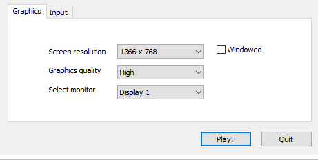
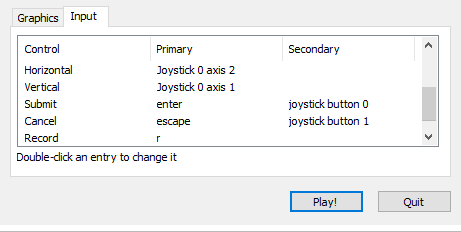
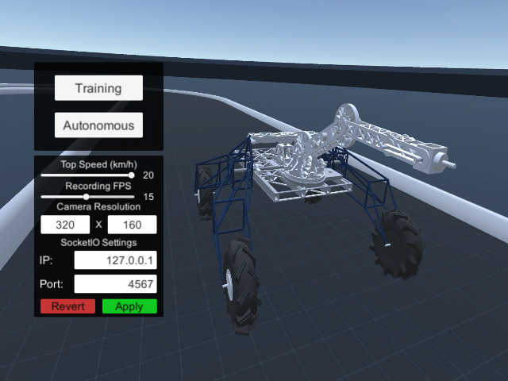
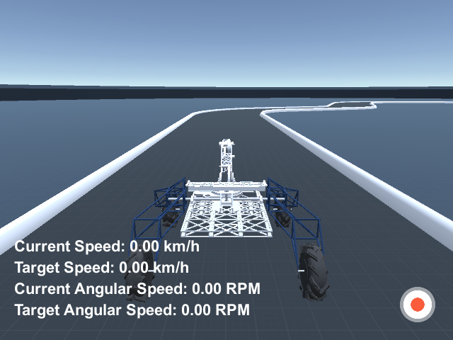
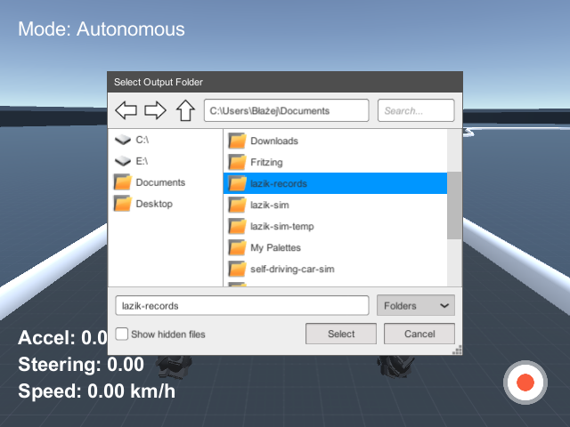
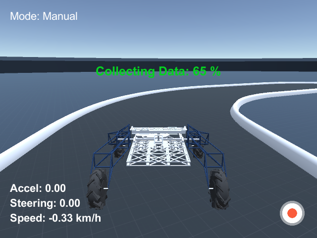

Łazik Simulator
===============

Symulacja uniwersyteckiego łazika w Unity

# Skompilowane Wersje

Wersje aplikacji zbudowane na systemy Windows, Linux i Mac dostępne w zakładce Downloads

***

# Jak korzystać

Po uruchomieniu pliku wykonywalnego, powinno pojawić się okno z konfiguracją.

"Graphics quality" radzę ustawić, tak żeby aplikacja działała płynnie i nie zmieniać jej już później, gdyż może ona wpłynąć na wygląd nagrywanych przejazdów. Rozdzielczość nie powinna mieć wpływu na nagrane przejazdy.

Aby uzyskać sterowanie "łazikowe", `Vertical` ustaw na lewą gałkę, a `Horizontal` na prawą.

Po naciśnięciu `Play`, powinno ukazać się Menu.

## Tryb Training

W trybie tym łazik sterowany jest manualnie. Sterowanie polega na zadaniu prędkości (Target Speed) oraz prędkości obrotowej (Target Angular Speed). Prędkość zadawana jest przez `Vertical`, a prędkość obrotowa przez `Horizontal`.

Łazik posiada 2 kontrolery PID, które sterują silnikami (jeden odpowiedzialny za nadanie odpowiedniej wartości `Speed`, drugi `Angular Speed`)

### Nagrywanie przejazdu

Aby rozpocząć nagrywanie przejazdu naciśnij klawisz `Record` (domyślnie `r`) lub przycisk nagrywania widoczny w prawym dolnym rogu aplikacji.

Jeśli wyskoczy okienko z wyborem folderu, wskaż folder zapisu i ponownie naciśnij przycisk nagrywania. Nagrywanie powiwnno się rozpocząć, a ikona przycisku powinna zmienić się na ikonę Stop.

Aby zakończyć nagrywanie ponownie naciśnij przycisk. 

Aplikacja zacznie odtwarzać trasę i zapisywać zrzuty z kamery na dysk.

### Czytanie logów

We wskazanym folderze powstanie plik `driving_log.csv`. Każdy rekord tego pliku ma postać:

>`camera1,camera2,...,cameraN,accel,steering,speed,angularSpeed`

Znaczenie powyższych pól:

* camera - ścieżka do zrzutu z kamery (domyślnie są 3 kamery nazwane: left, center i right)
* accel - wartość z przedziału [-1,1] oznaczająca prędkość zadaną przez użytkownika (wartość `Vertical`). Wartość 1 oznacza, że zadana została prędkość równa "Top Forward Speed" (w tej chwili ustawione na 20km/h)
* steering - wartość z przedziału [-1,1] oznaczająca prędkość obrotową zadaną przez użytkownika (wartość `Horizontal`). ("Top Angular Speed" ustawione jest na 15 RPM)
* speed - Aktualna prędkość łazika wyrażona w km/h
* angularSpeed - Aktualna prędkość obrotowa łazika wyrażona w RPM

## Tryb Autonomous

W tym trybie wyłączone jest sterowanie manualne. Jest ono natomiast przekazywane przez protokół Socket.IO. Przykład użycia można znaleźć w folderze `example`.

### Przykładowy program

Wymagania:

* `Python` (testowano na wersji 3.6.4)
* pakiety z pliku `requirements.txt`. Można je zainstalować poleceniem `pip install -r requirements.txt` (polecam stworzyć do tego oddzielne środowisko pythonowe programem `virtualenv`, żeby nie zaśmiecać systemu)

Uruchamianie:

1. Uruchom symulator (najlepiej w trybie `Windowed`, żeby widzieć łazik na żywo).
2. Wybierz tryb `Autonomous`
2. Uruchom z terminala skrypt `drive.py`

Działanie:

* symulator otwiera socket na porcie 4567
* skrypt łączy się przez ten socket
* symulator po otwarciu połączenia, wysyła Event `telemetry`, zawierający dane o aktualnej prędkości łazika oraz obraz z przedniej kamery
* skrypt odbiera event, konwertuje otrzymany obraz do postaci tablicy RGB i pokazuje plot tego obrazka
* gdy użytkownik zamknie plot, skrypt wysyła Event `steer` z losowymi wartościami `accel` i `steering`
* symulator odbiera dane sterowania i przekazuje je do kontrolera łazika
* skrypt wysyła Event `request_telemetry`
* symulator odbiera event i wysyła `telemetry` przy następne klatce