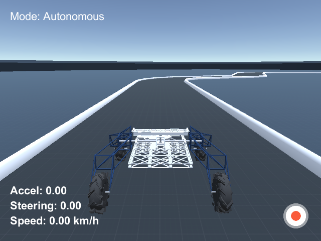

Łazik Simulator
===============

Symulacja uniwersyteckiego łazika w Unity

## Skompilowane Wersje

Wersja 2, 22.01.17
[Windows](https://bitbucket.org/thecontinuum/lazik-sim/downloads/lazik-sim_v2_Windows.zip)
[Mac](https://bitbucket.org/thecontinuum/lazik-sim/downloads/lazik-sim_v2_Mac.zip)
[Linux](https://bitbucket.org/thecontinuum/lazik-sim/downloads/lazik-sim_v2_Linux.zip)

- nowy system sterowania
- całkiem nowe menu
- możliwość zapisywania i zmieniania ustawień
- logo continuum w splash screenie

Wersja 1, 14.01.17
[Windows](https://bitbucket.org/thecontinuum/lazik-sim/downloads/lazik-sim_v1_Windows.zip)
[Mac](https://bitbucket.org/thecontinuum/lazik-sim/downloads/lazik-sim_v1_Mac.zip)
[Linux](https://bitbucket.org/thecontinuum/lazik-sim/downloads/lazik-sim_v1_Linux.zip)

***

# Jak korzystać

Po uruchomieniu pliku wykonywalnego, powinno pojawić się okno z konfiguracją.

"Graphics quality" radzę ustawić, tak żeby aplikacja działała płynnie i nie zmieniać jej już później, gdyż może ona wpłynąć na wygląd nagrywanych przejazdów. Rozdzielczość nie powinna mieć wpływu na nagrane przejazdy.

Aby uzyskać sterowanie "łazikowe", `Accel` ustaw na lewą gałkę, a `Steering` na prawą.

## Menu

Po naciśnięciu `Play`, powinno ukazać się Menu.

Przyciski `Training` i `Autonomous` uruchamiają przejazd w odpowiednim trybie.

### Ustawienia

* `Top Speed` - Ograniczenie prędkości na kołach
* `Recording FPS` - ilość zapisywanych sampli na sekundę (w rzeczywistości może ona być trochę mniejsza, ta opcja gwarantuje tylko, że nie przekroczy tej wartości)
* `Camera Resulotion` - rozdzielczość nagrywanych oraz wysyłanych obrazów
* `SocketIO Settings` - IP i Port serwera, na który symulator wysyła dane i od którego otrzymuje sterowanie (Tryb `Autonomous`)

Ustawienia są zapisywane w pliku `settings.json` w folderze `Data`. Przycisk `Apply` zapisuje obecne ustawienia, a przycisk `Revert` wczytuje je z pliku.

## Tryb Training

W trybie tym łazik sterowany jest manualnie. Wartość `Accel` odpowiada za jazdę w przód i w tył, a wartość `Steering` za obracanie łazikiem.

W UI widnieją aktualne wartości `Accel` i `Steering` oraz prędkość łazika obliczana jako średnia prędkości na wszystkich kołach.

### Nagrywanie przejazdu

Aby rozpocząć nagrywanie przejazdu naciśnij klawisz `Record` (domyślnie `r`) lub przycisk nagrywania widoczny w prawym dolnym rogu aplikacji.

Jeśli wyskoczy okienko z wyborem folderu, wskaż folder zapisu i ponownie naciśnij przycisk nagrywania. Nagrywanie powiwnno się rozpocząć, a ikona przycisku powinna zmienić się na ikonę Stop.

Aby zakończyć nagrywanie ponownie naciśnij przycisk. 

Aplikacja zacznie odtwarzać trasę i zapisywać zrzuty z kamer na dysk. 

**Kamery**

Łazik posiada 3 kamery: jedna centralna oraz 2 z boku obrócone o 20 stopni. Pozycje kamer przedstawia poniższy rysunek:

### Czytanie logów

We wskazanym folderze powstanie plik `driving_log.csv`. Każdy rekord tego pliku ma postać:

>`camera1,camera2,...,cameraN,accel,steering,speed`

Znaczenie powyższych pól:

* camera - ścieżka do zrzutu z kamery (domyślnie są 3 kamery nazwane: left, center i right)
* accel - wartość `Accel` zadana w danym momencie
* steering - wartość `Steering` zadana w danym momencie
* speed - prędkość łazika wyrażona w km/h (średnia prędkości na wszystkich kołach)
* mode - tryb sterowania (M - manual, A - Autonomous)

## Tryb Autonomous

W tym trybie sterowanie domyślnie przekazywane jest przez protokół Socket.IO. Przykładowy program, do którego może się połączyć symulator znajduje się w folderze `example`.

W UI widnieje dodatkowa informacja o aktualnym trybie sterowania (`Manual` lub `Autonomous`). Przyciskiem `Control` (domyślnie lewy ctrl) można przełączać się między trybami.

### Przykładowy program

Wymagania:

* `Python` (testowano na wersji 3.6.4)
* pakiety z pliku `requirements.txt`. Można je zainstalować poleceniem `pip install -r requirements.txt`

Uruchamianie:

1. Uruchom symulator
2. Wybierz tryb `Autonomous`
3. Uruchom skrypt `drive.py`

Działanie:

* skrypt tworzy serwer Socket.IO na porcie 4567
* symulator łączy się z serwerem
* symulator po otwarciu połączenia, wysyła Event `telemetry`, zawierający dane o aktualnej prędkości łazika oraz obraz z centralnej kamery
* skrypt odbiera event, konwertuje otrzymany obraz do postaci tablicy RGB i pokazuje plot tego obrazka
* gdy użytkownik zamknie plot, skrypt wysyła Event `steer` z losowymi wartościami `accel` i `steering`
* symulator odbiera dane sterowania i przekazuje je do kontrolera łazika
* skrypt wysyła Event `request_telemetry`
* symulator odbiera event i wysyła `telemetry` przy następne klatce